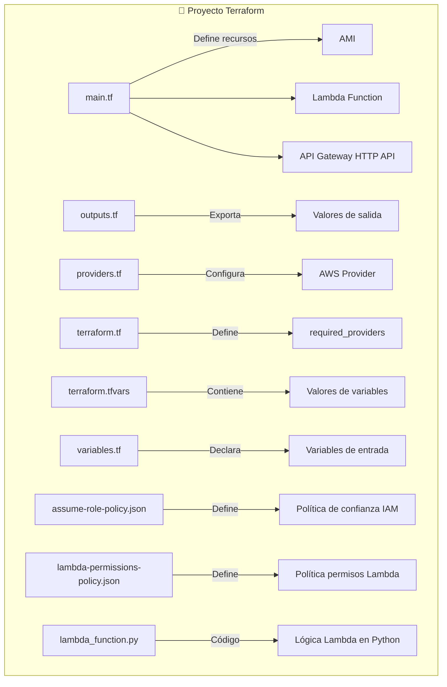
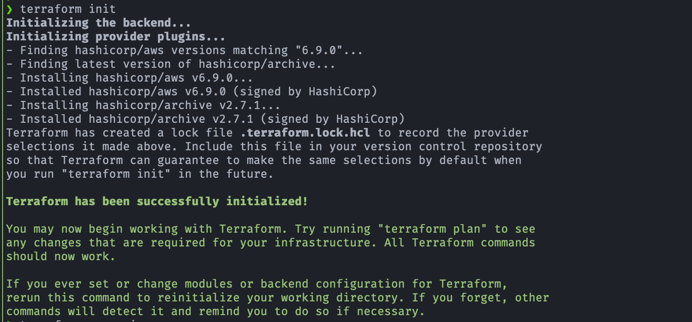
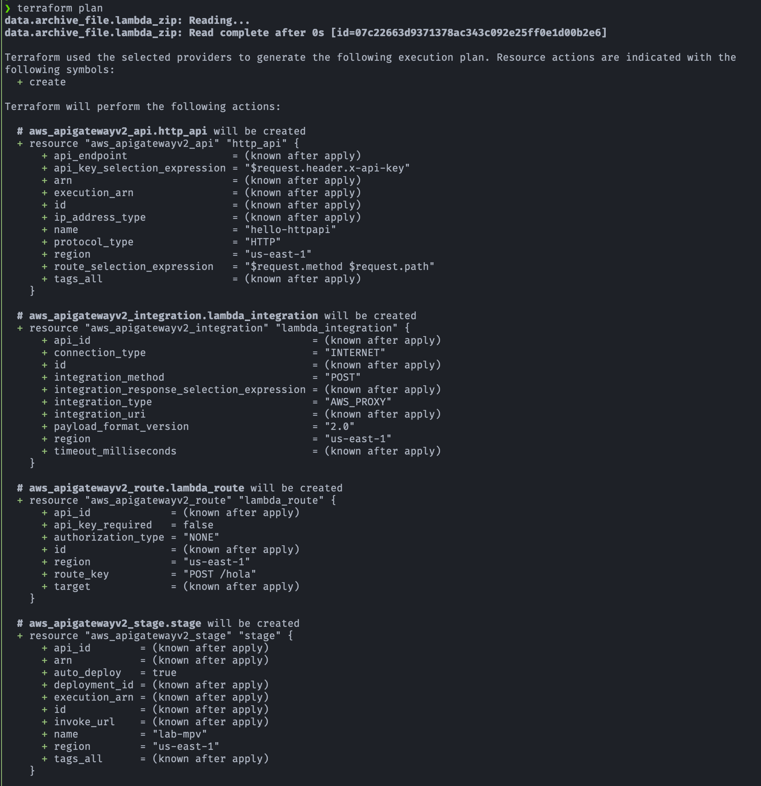
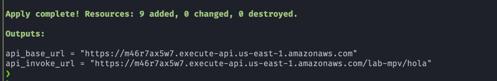
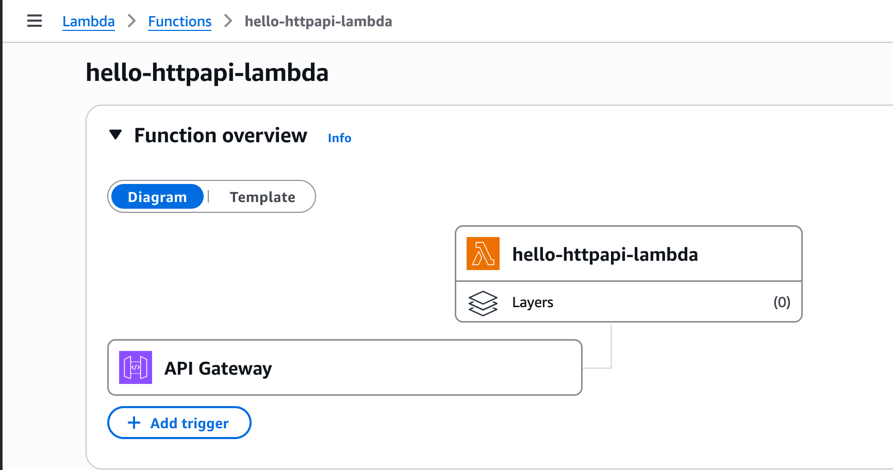
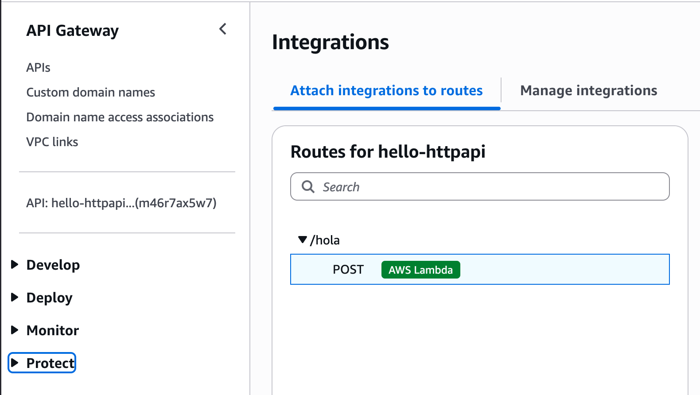
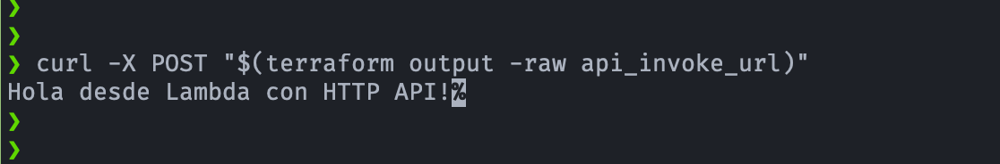
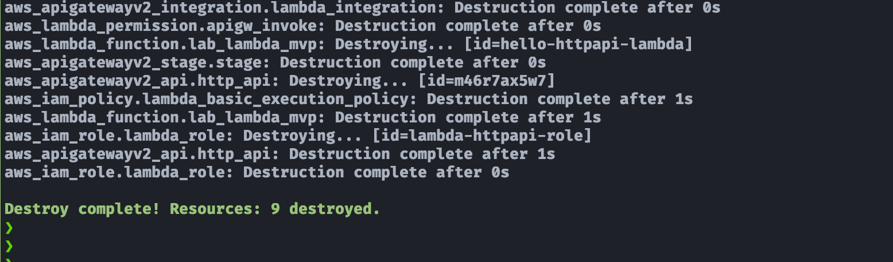

# 🧪 Lab Personal: AWS Lambda + API Gateway HTTP API + Terraform

[](#)
[](#)
[](#)
[](#)


¡Bienvenido a mi **laboratorio personal**! 🚀 
Este repo es un espacio para **experimentar y aprender** sobre `AWS Lambda y Terraform`.  
Aquí guardo pruebas, errores, descubrimientos y notas de aprendizaje, sin preocuparme por que todo sea perfecto. 😅

---

## 🎯 Objetivos
- Practicar la creación de **funciones Lambda en Python**.
- Desplegar recursos en AWS usando **Terraform**.
- Explorar cómo conectar Lambda con **IAM Roles** y permisos.
- Documentar errores y soluciones encontradas durante las pruebas.
- Crear un Minimum Viable Product (MVP) profesional y limpio:
    - Lambda empaquetada
    - HTTP API Gateway moderno
    - IAM con templatefile para confianza y permisos
    - Política mínima para logs
    - Fácil de mantener y escalar a futuro

---

## 📖 Descripción del proyecto
- El ejemplo de uso de AWS Lambda que tiene una función que al ser invocada, ejecuta un código y devuelve un resultado.
- Este patrón se conoce como **invocación síncrona** y no requiere la integración de otros servicios complejos. A menudo se usa para tareas simples como probar un código o realizar un cálculo rápido.

---

## ⚙️ Tecnolgías usadas
- Terraform
- AWS Lambda
- AWS IAM
- AWS API Gateway HTTP API
    - Esto es más moderno, barato y con menos recursos que usar REST API
- Python

---

## 🛠️ Estructura de Archivos del Proyecto (Terraform + Lambda + API Gateway)

| Archivo                        | Contenido principal                                                                                   |
|--------------------------------|-------------------------------------------------------------------------------------------------------|
| **main.tf**                    | - Declaración de recursos principales:<br> • Lambda function<br>  • API Gateway (HTTP API)<br>  • Roles y permisos mínimos necesarios |
| **outputs.tf**                 | - Definición de salidas útiles:<br>  • URL del endpoint HTTP API<br>  • Nombre/ARN de la función Lambda |
| **providers.tf**               | - Configuración del proveedor AWS:<br>  • `provider "aws" { region = var.region ... }`<br>  • Opcional: configuración de perfiles/assume role |
| **terraform.tf**               | - Definición de versiones y proveedores requeridos:<br>  • `required_version` de Terraform<br>  • `required_providers` (ej. AWS) |
| **terraform.tfvars**           | - Valores concretos de variables:<br>  • Región (`region`)<br>  • Nombre de función Lambda<br>  • "Nombre de la API<br>  • Versión de python que usa la Lambda|
| **variables.tf**               | - Declaración de variables reutilizables:<br>  • `variable "region"`<br>  • `variable "lambda_name"`<br>  • `variable "api_name"` |
| **assume-role-policy.json**    | - Política JSON de confianza para el rol de ejecución Lambda:<br>  • Define quién puede asumir el rol (ej. `lambda.amazonaws.com`) |
| **lambda-permissions-policy.json** | - Política JSON de permisos para la Lambda:<br>  • Permisos de logs en CloudWatch<br>  • Acceso a servicios que la Lambda necesite (ej. S3, DynamoDB, etc.) |
| **lambda_function.py**         | - Código de la función Lambda en Python:<br>  • Handler principal (`def lambda_handler(event, context)`) que procesa requests del API Gateway |

- Diagrama de Archivos y Roles en el Proyecto
    - Este diagrama refleja cómo cada archivo tiene un rol dentro del proyecto: desde la infraestructura (Terraform) hasta la lógica de negocio (Lambda).


---

## 🚀 Probar el funcionamiento del laboratorio (Outcome)
### 1. Inicio de sesión con AWS SSO en la CLI
- Iniciar sesión en AWS IAM Identity Center (SSO) usando el perfil tf, abre el navegador para autenticarte y guarda credenciales temporales.
    ```bash
    aws sso login --profile tf
    ```
### 2. Ejecución de terraform init
<p align="center">
    
</p>

### 3. Ejecución de terraform plan
- La imagen muestra una parte del resultado:
<p align="center">
    
</p>

### 4. Ejecución de terraform apply
<p align="center">
    
</p>

### 5. Verificar en consola de AWS
- Diagrama de componentes de la Lambda:
<p align="center">
    
</p>

- API Integrations:
<p align="center">
    
</p>

### 6. Invocación con cURL
- Una vez desplegado (terraform apply), copia la URL del output:
    ```bash
    curl -X POST "$(terraform output -raw api_invoke_url)"
    ```
- Respuesta esperada:
<p align="center">
    
</p>

### 7. Ejecución de terraform destroy
- La imagen muestra una parte del resultado:
<p align="center">
    
</p>


---

## ⚡ Mejoras posibles de este Minimum Viable Product de Lambda + API
1. Versión extendida next-level 1
- Mejoras:
    - GET /hola con query string 
    - GET y POST /hola
    - Logs enriquecidos en CloudWatch
    - Logs con retención para Lambda y API Gateway (HTTP API v2)
    - Lambda tenga acceso a leer de S3
    - Uso de variable de Terraform para bucket
    - CORS
- ¿Qué se gana con esta versión next-level 1?
    - Rutas GET/POST con el mismo integration (proxy).
    - CORS configurable.
    - Logs controlados y con retención:
        - CloudWatch Logs de Lambda (por función).
        - Access Logs del API Gateway (JSON, fácil de parsear).
    - IAM limpia con Terraform file() y mínimo privilegio a S3.
    - Variables para bucket y retención.
    - Payload v2.0 (HTTP API moderno, menor costo/latencia).
2. Versión extendida next-level 2
- Mejora: WAF (AWS WAF v2) al HTTP API
    - Crear el WebACL (WAF)
    - Asociar el WebACL al API Gateway HTTP API
- ¿Qué se gana con esta versión-next-level 2?
    - Protección contra ataques comunes en aplicaciones web
    - Filtrado de tráfico no deseado antes de que llegue a tu Lambda o backend
    - Mitigación de DDoS a nivel de aplicación (L7)
    - Reglas gestionadas (Managed Rules) listas para usar
    - Flexibilidad con reglas personalizadas
    - Cumplimiento y buenas prácticas de seguridad
3. Versión extendida next-level 3
- Mejora: auth con IAM/Cognito para cerrar el endpoint
    - Autenticación con IAM: Cuando usas IAM auth, estás diciendo que solo identidades AWS autorizadas (usuarios, roles, aplicaciones con credenciales válidas de AWS) pueden invocar tu API.
    - Autenticación con Amazon Cognito: Aquí cierras el endpoint pero en vez de identidades IAM puras, usas usuarios de una aplicación (login con usuario/contraseña, redes sociales, SAML, etc.).
 - ¿Qué se gana con esta versión-next-level 3?
    - Autenticación con IAM:
        - Con esto, el endpoint queda inaccesible públicamente, salvo para clientes que usen credenciales AWS válidas (con permisos).
    - Amazon Cognito: 
        - Esto permite exponer un endpoint seguro a usuarios externos sin darles credenciales IAM.
        - Acceso cerrado a usuarios autenticados con JWT.
    - Ambos cierran el API (no cualquiera puede entrar), y es considerado best practice para cualquier endpoint sensible.
    - Diferencias:

| Método           | Caso típico                                                                    | Nivel de seguridad                        |
| ---------------- | ------------------------------------------------------------------------------ | ----------------------------------------- |
| **IAM Auth**     | Acceso desde apps internas, microservicios, Lambda, CI/CD con credenciales AWS | Muy fuerte (firmas SigV4, control IAM)    |
| **Cognito Auth** | Acceso desde usuarios finales (web, móviles) con login y JWT                   | Flexible, más amigable para apps públicas |
| **Sin auth**     | Endpoint público (ej. webhook)                                                 | Riesgoso, cualquiera puede invocar        |

---

## 💡 Notas de aprendizaje
- Cada cambio importante se documenta en `learning/`.
    - `learning/README.md`: Registro de avances semanales.
    - `learning/experiments/`: Scripts de prueba que no entran en el repo oficial.
    - `learning/cheatsheets/`: Comandos útiles y mini-guías para referencia rápida.

---

## 📌 Notas
> Este repo es **experimental**, no es un proyecto oficial de CyberNuclei.<br>
> Se recomienda romper cosas y aprender de los errores 😎<br>
> Este repo personal sirve como **sandbox** para probar ideas y aprender nuevas tecnologías.

## 🔗 Referencias
- [CyberNuclei Labs](https://github.com/cybernuclei) → repos oficiales y demos públicas.

---

### 📝 Licencia

Este repositorio está disponible bajo la licencia MIT.  
Puedes usar, modificar y compartir libremente el contenido, incluso con fines comerciales.  
Consulta el archivo [`LICENSE`](./LICENSE) para más detalles.

---
