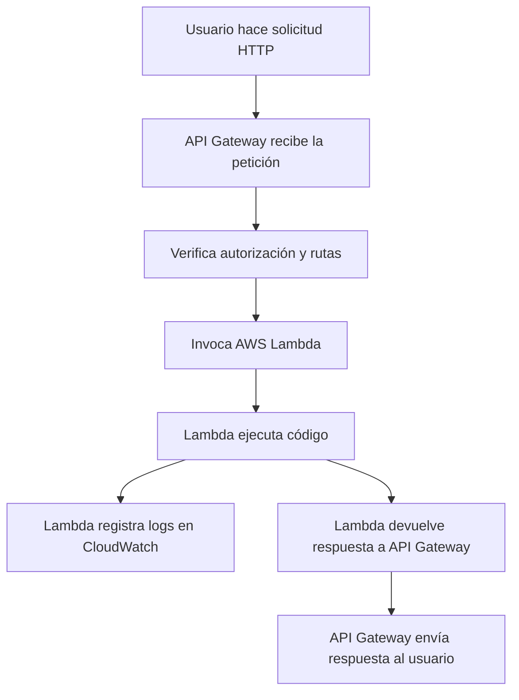
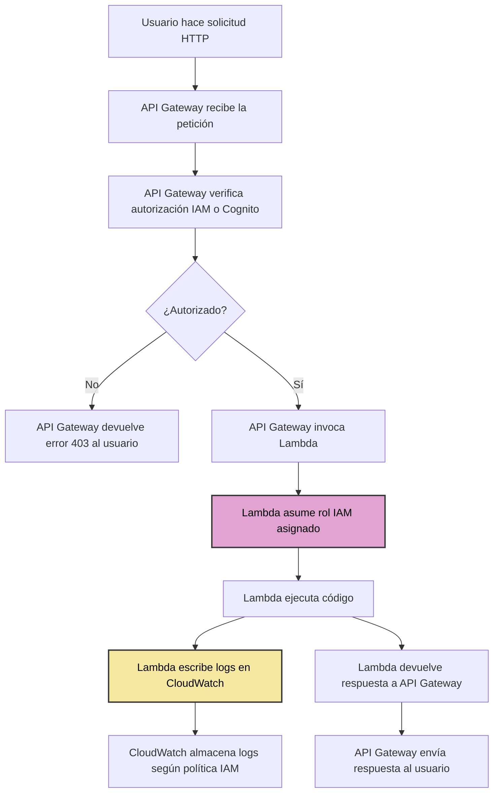
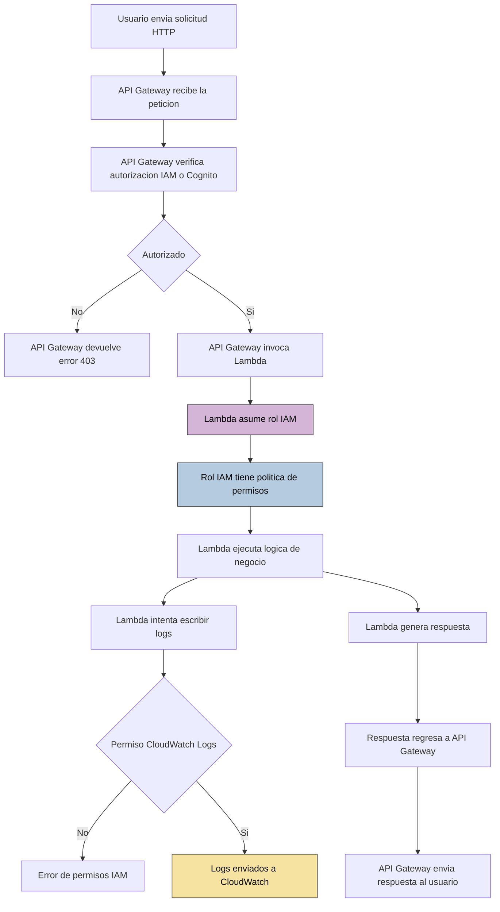

# 🧪 Diario de aprendizaje del lab: AWS Lambda + Terraform

## 🔥 Week 01

### ⚡ ¿Qué pasa si en solo modifico el archivo .tftpl y ejecuto terraform apply?
- Cuando trabajas con `templatefile() + .tftpl`, Terraform genera el JSON en tiempo de ejecución antes de aplicar cambios.
- Si modificas solo el archivo `.tftpl` y no cambias nada más en el .tf, Terraform detectará un cambio en la política generada.
- Durante `terraform plan`, verás que la política IAM (aws_iam_policy, aws_iam_role_policy, etc.) tiene un diff porque el JSON resultante cambió.
- Al hacer `terraform apply`, Terraform actualizará ese recurso en AWS con la nueva versión de la política.
- ⚠️ Importante
    - Terraform no versiona el `.tftpl`, solo compara el resultado renderizado con lo que está aplicado en AWS.
    - Si los cambios en el `.tftpl` son equivalentes semánticamente (ejemplo: cambiar orden de claves JSON pero sin modificar permisos), AWS IAM a veces considera que no hubo cambio. Sin embargo, Terraform puede seguir mostrando diffs si la cadena generada no coincide byte a byte.
    - En prácticas profesionales, se suele usar `terraform plan` primero para revisar qué impacto tendrá antes de hacer apply.

#### 🔗 Referencias templatefile()
- [templatefile Function](https://developer.hashicorp.com/terraform/language/functions/templatefile)

---

### ⚡ Si el JSON de tu política no necesita reemplazo de variables
- Lo más simple y correcto es usar file().
- Ventajas de `file()` en este caso:
    - No hace render de variables, solo lee el contenido del archivo.
    - Evita errores de sintaxis si accidentalmente Terraform intenta interpretar `${}`.
    - Es más claro y directo para archivos estáticos de JSON.
- No necesitas `jsonencode()` ni `templatestring()` si no vas a reemplazar variables dinámicas dentro del JSON.
- 💡 Nota: `jsonencode()` solo es útil si defines la política directamente en HCL y quieres convertirla a JSON dinámicamente. Si ya tienes un JSON completo, `file()` es la forma más limpia.
- Ejemplo:
    ```hcl
    resource "aws_iam_policy" "example" {
        name   = "example-policy"
        policy = file("${path.module}/example-policy.json")
    } 
    ```
#### 🔗 Referencias file()
- [file Function](https://developer.hashicorp.com/terraform/language/functions/file)

---

### ⚡ Diferencia en Terraform entre usar un ARN de política administrada por AWS y crear tu propia política JSON
- ARN de política administrada:
    - Ejemplo de política administrada por AWS (ARN)
        ```hcl
        resource "aws_iam_role_policy_attachment" "lambda_basic_execution_policy" {
            role       = aws_iam_role.lambda_role.name
            policy_arn = "arn:aws:iam::aws:policy/service-role/AWSLambdaBasicExecutionRole"
        }
        ```
    - ✅ Ventajas:
        - Muy simple, solo referencias el ARN.
        - Siempre actualizado por AWS.
        - Menos riesgo de errores.
    - ⚠️ Limitaciones:
        - No puedes cambiar permisos.
        - Dependencia directa de AWS → si AWS cambia la política, tu rol también cambia automáticamente.
- Crear tu propia política JSON:
    - Ejemplo de crear tu propia política personalizada
        ```hcl
        # Política de permisos para Lambda (logs, etc.)
        # Sim reemplazo de variables dinámicas dentro del JSON.
        resource "aws_iam_policy" "lambda_basic_execution_policy" {
            name   = "lambda-logs-policy"
            policy = file("${path.module}/lambda-permissions-policy.json")
        }
        ```
    - ✅ Ventajas:
        - Control total sobre los permisos.
        - Puedes limitar recursos específicos, no usar *.
        - No dependes de cambios externos de AWS.
    - ⚠️ Limitaciones:
        - Debes mantener la política actualizada tú mismo.
        - Más complejo que usar la política administrada.
- 💡 Resumen práctico:
    - Si quieres rapidez y menor mantenimiento → usa el ARN de AWS.
    - Si necesitas control total y personalización → crea tu propia política JSON.

#### 🔗 Referencias políticas de AWS
- [AWSLambdaBasicExecutionRole](https://docs.aws.amazon.com/es_es/aws-managed-policy/latest/reference/AWSLambdaBasicExecutionRole.html)

---

### ⚡ Entendiendo Rol y política
1. Rol IAM para Lambda
    - Este rol es como un “permisos contenedor” que tu Lambda puede asumir.
    - El archivo `assume-role-policy.json` (política de confianza) dice quién puede usar este rol.
    - Esto significa: “Lambda puede asumir este rol y recibir sus permisos”.
    - **Importante:** aquí no se definen permisos todavía, solo quién puede usar el rol.
2. Política de permisos
    - La política contiene qué puede hacer la Lambda mientras use este rol.
    - Esto le da permiso a Lambda solo para escribir logs en CloudWatch.
    - En este ejemplo esta especificando explícitamente los ARNs de CloudWatch Logs, usando comodines para región y cuenta (`*`):
        ```json
        "Resource": "arn:aws:logs:*:*:*"
        ```
    - Si quisieras que Lambda acceda a S3, DynamoDB, etc., necesitarías agregar esas acciones a la política.
3. Asociar la política al rol
    - Aquí le dices a AWS: “este rol ahora tiene estos permisos”.
    - La Lambda hereda estos permisos porque asumirá este rol.
4. Función Lambda
    - Cuando se ejecuta la Lambda, AWS automáticamente asume el rol que le asignaste.
    - Por lo tanto, los permisos de la Lambda = los permisos del rol + políticas adjuntas.
    - En este Lab la Lambda solo puede escribir logs, porque eso es lo que dice la política.
- Definiciones:
    - Rol      = “quién puede usarlo y qué permisos tiene”
    - Política = “qué acciones puede hacer el rol”
    - Lambda   = “asume el rol, por lo tanto obtiene esos permisos mientras corre”
- 💡 **Tip:** Piensa en el rol como un “contenedor de permisos”, y la Lambda como “usuario temporal” que entra en ese contenedor cada vez que se ejecuta.
- Digrama de la relación rol, política y Lambda:
    ```mermaid
    flowchart TD
        A[Lambda Function] -- Asume --> B[IAM Role<br>lambda-httapi-role]
        B --> C[Políticas adjuntas al rol<br>lambda-logs-policy]
        C --> D[Permisos que Lambda puede usar<br>logs:CreateLogGroup<br>logs:CreateLogStream<br>logs:PutLogEvents]
    ```
---

### ⚡ Diagrama de flujo para una Lambda invocada vía API Gateway
- Diagrama de flujo para una Lambda invocada vía API Gateway, mostrando los pasos principales: petición, ejecución de la Lambda y logs en CloudWatch.


📌 **Explicación de los nodos:**

- **A:** El usuario hace la solicitud (por ejemplo, un `GET` o `POST` a tu endpoint).  
- **B:** API Gateway recibe la petición.  
- **C:** Se aplican autorizaciones, validaciones y mapeo de rutas.  
- **D:** API Gateway invoca la Lambda asociada.  
- **E:** La Lambda ejecuta la lógica que definiste.  
- **F:** La Lambda envía logs a CloudWatch.  
- **G:** Lambda devuelve la respuesta.  
- **H:** API Gateway reenvía la respuesta al usuario.

---

### ⚡ Diagrama que incluye los roles IAM, políticas y permisos de CloudWatch
- Diagrama que incluye los roles IAM, políticas y permisos de CloudWatch, mostrando cómo fluye la petición, la autorización y la ejecución de la Lambda:


📌 **Detalles clave en este diagrama:**

1. **API Gateway:** recibe la solicitud y aplica autorización antes de invocar la Lambda.  
2. **Rol IAM de Lambda:** la Lambda **no tiene permisos propios por defecto**; necesita un rol que le permita ejecutar acciones como escribir logs en CloudWatch.  
3. **CloudWatch:** recibe logs solo si la política IAM de la Lambda lo permite.  
4. **Flujo de error:** si la autorización falla, se devuelve un error 403.  
5. **Respuesta final:** la Lambda retorna datos a API Gateway, que los envía al usuario.  

---

### ⚡ Diagrama en donde los pasos de IAM y CloudWatch se detallen más visualmente
- Los pasos de IAM y CloudWatch se detallen más visualmente
    - El usuario → API Gateway
    - El rol IAM que asume Lambda
    - La política de permisos para CloudWatch
    - El flujo de logs y respuesta final



📌 **Cómo leerlo:**
1. El **usuario** hace la petición → llega a **API Gateway**.  
2. API Gateway revisa si la petición está autorizada.  
   - Si **no**: regresa **403 Forbidden**.  
   - Si **sí**: invoca la **Lambda**.  
3. La **Lambda asume su rol IAM** y ejecuta la lógica.  
4. Cuando intenta escribir logs en **CloudWatch**:  
   - Si el rol **no tiene permisos**, falla.  
   - Si **sí tiene permisos**, los logs se guardan en **CloudWatch**.  
5. La Lambda genera una **respuesta**, que pasa por API Gateway y regresa al **usuario**.  

---

### ⚡ Integración entre una función AWS Lambda y un API Gateway (tipo HTTP API).
1. Creas el API HTTP.
2. Lo integras con Lambda.
3. Defines una ruta (POST /hola).
4. Lo publicas en un stage (lab_mvp).
5. Le das permiso a API Gateway para llamar a Lambda.

#### Diagrama del flujo de integración entre una función AWS Lambda y un API Gateway
```mermaid 
flowchart TD
    subgraph API_Gateway["API Gateway (HTTP API)"]
        API[aws_apigatewayv2_api]
        INT[aws_apigatewayv2_integration]
        ROUTE[aws_apigatewayv2_route "POST /hola"]
        STAGE[aws_apigatewayv2_stage "lab_mvp"]
    end

    subgraph Lambda["AWS Lambda"]
        LAMBDA[aws_lambda_function.lab_lambda_mvp]
        PERM[aws_lambda_permission]
    end

    API --> INT --> ROUTE --> STAGE
    ROUTE -->|invoca| LAMBDA
    STAGE -->|expone endpoint| API
    PERM -->|permite invocar| LAMBDA
```

#### 🔗 Referencias políticas de AWS
- []()

---

### ⚡ Texto
- Texto

#### 🔗 Referencias políticas de AWS
- []()

---

### ⚡ Texto
- Texto

#### 🔗 Referencias políticas de AWS
- []()

---
